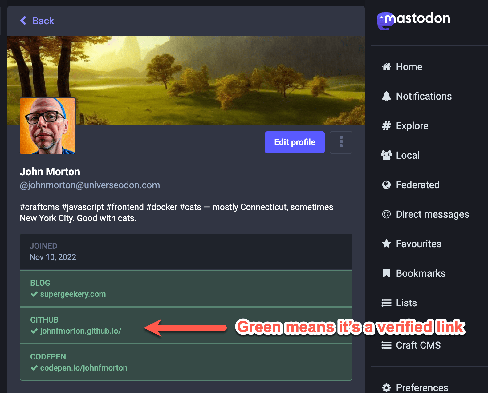

# johnfmorton.github.io

This is a simple repo that redirects to my main GitHub page.

The main purpose of this page is so that my Mastodon account will verify that my GitHub repo actually belongs to me. That's accomplished through the following tag.

```
<link href="https://universeodon.com/@johnmorton" rel="me">
```



For more about this repo, see the page that inspired me to make it at https://til.simonwillison.net/mastodon/verifying-github-on-mastodon.
